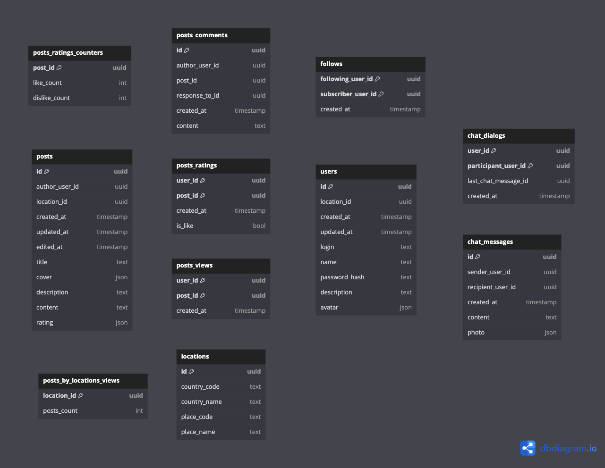

# Модель хранения данных

В качестве БД для хранения всех данных (кроме статики) выбираю *PostgreSQL*, ссылаясь на пункт из лекции "Навык работы с технологией" :)) Хотя понимаю, что в таком приложении ACID транзакции не требуются, и стоит взять что-то типа *Cassandra*, так как масштабироваться с возрастанием объема данных с ней будет гораздо проще, но вот практического опыта с ней не было, поэтому как-то сходу под неё модель запилить нет возможности.

Статика (изображения в моем случае) будут храниться в BLOB-хранилище (S3, Ceph)

Из схемы данных специально убрал Foreign Keys, чтобы не тратить место на индексы и не тратить время при записи в таблицы, в данном случае не вижу пользы от Foreign Keys.