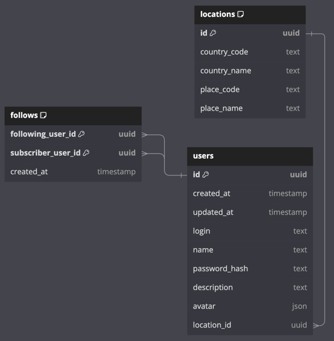
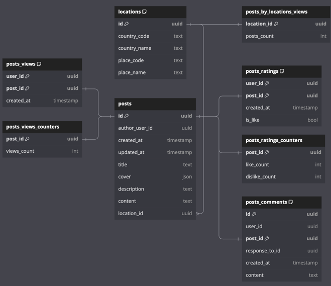
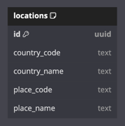

# Модель хранения данных

В качестве технологии БД для хранения всех данных (кроме статики) выбираю *PostgreSQL*, ссылаясь на пункт из лекции "Навык работы с технологией" :)) Хотя понимаю, что в таком приложении ACID транзакции не требуются, и стоит взять что-то типа *Cassandra*, так как масштабироваться с возрастанием объема данных с ней будет гораздо проще, но вот практического опыта с ней не было, поэтому как-то сходу под неё модель запилить нет возможности.

Статика (изображения в моем случае) будут храниться в BLOB-хранилище (S3, Ceph).

Планируется в отдельных БД хранить:
* Пользователей и подписки 
* Посты (и все, что к ним относятся - рейтинги, комменты, просмотры)
* Чаты
* Локации. Однако локации денормализованы по остальным базам для более быстрого доступа на месте. Но будет мастер-сервис по данным локаций, который будет рассылать сообщения с изменениями локаций.

## Модель хранения пользователей и подписок

## Модель хранения постов

## Модель хранения чатов

## Модель хранения локаций

